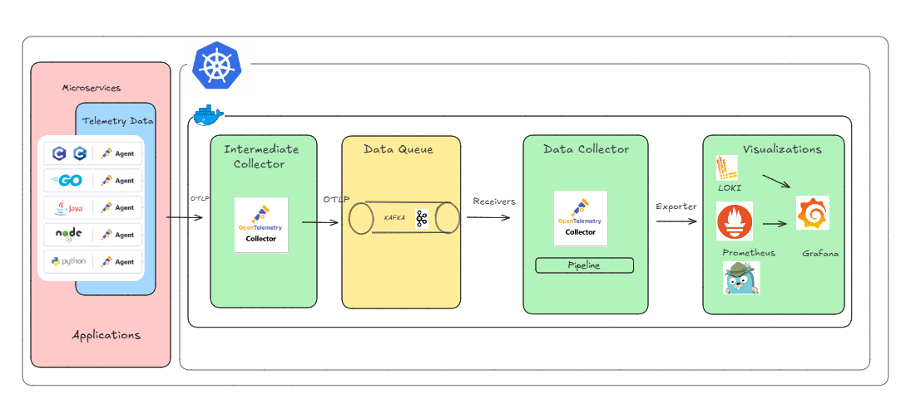

# Observability
projects dedicated to monitoring and observability


## Architecture



## How to run the infrastructure

```bash
cd otel-multi-colector-kafka
docker-compose -f otel-multi-colector-kafka-compose up -d
```

Then you can execute the three applications on their respective directories with

* springboot-client (8081 port)

```bash
cd springboot-client
mvn spring-boot:run
```

* springboot-backend (8082 port)

```bash
cd springboot-backend
mvn spring-boot:run
```

* python-app (8000 port)

```bash
cd python-app

pip install opentelemetry-distro opentelemetry-exporter-otlp opentelemetry-instrumentation-fastapi opentelemetry-instrumentation-requests opentelemetry-instrumentation-logging

set OTEL_EXPORTER_OTLP_ENDPOINT=http://localhost:4318
set OTEL_PYTHON_LOGGING_AUTO_INSTRUMENTATION_ENABLED=true

opentelemetry-instrument ^
  --traces_exporter otlp,console ^
  --metrics_exporter otlp,console ^
  --logs_exporter otlp,console ^
  --metric_export_interval 5000 ^
  --exporter_otlp_protocol http/protobuf ^
  --exporter_otlp_endpoint http://localhost:4318 ^
  --service_name pythonApp ^
  uvicorn pythonApp:app 

```
* url Health Collectors

```bash
http://localhost:13133/
```
```bash
http://localhost:13134/
```
*  Display trace and metrics the collectors 

```bash
http://localhost:55679/debug/tracez
```
```bash
http://localhost:55680/debug/tracez
```
* url Prometheus

```bash
http://localhost:9091/graph
```
* url Grafana

```bash
http://localhost:3000/
```
* url Jaeger

```bash
http://localhost:16686/search
```
* url Kafka UI

```bash
http://localhost:8080/
```


